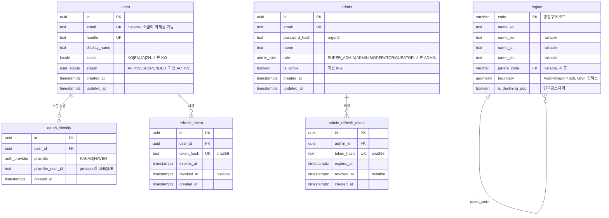

# 한땀 — DB ER 다이어그램 (현재 구현된 스키마)

> 아래 Mermaid 코드를 복사해 [mermaid.live](https://mermaid.live), FigJam의 **Mermaid 플러그인**,
> 또는 GitHub/Notion 마크다운에 붙여넣으면 다이어그램으로 렌더됩니다.
>
> 범위: 현재 마이그레이션까지 **실제 생성된 테이블**(auth/admin/region). 전체 설계상의
> 향후 테이블(place·certification·collection·challenge·contest 등)은 `docs/pipeline/02-design.md` 참고.

## Enum 타입
| enum | 값 |
|---|---|
| `locale` | KO, EN, JA, ZH |
| `user_status` | ACTIVE, SUSPENDED |
| `auth_provider` | KAKAO, NAVER |
| `admin_role` | SUPER_ADMIN, ADMIN, MODERATOR, CURATOR |
| `user_role` | *(deprecated — DB에 남아있으나 미사용, 추후 제거)* |

## 관계 요약
- **회원(`users`)** ─ 소셜 연결(`oauth_identity`) 1:N, 세션(`refresh_token`) 1:N
- **관리자(`admin`)** ─ 세션(`admin_refresh_token`) 1:N  *(회원과 완전 분리)*
- **지역(`region`)** ─ `parent_code` 로 시·도↔시·군·구 자기참조. (아직 다른 테이블과 FK 없음)
- PostGIS: `region.boundary` 는 `geometry(MultiPolygon,4326)` + GIST 인덱스
